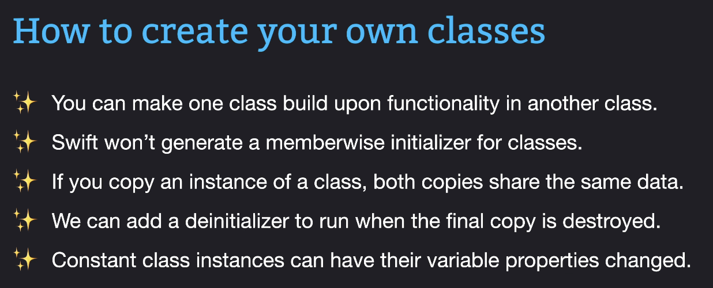

- `override` keyword is used to override the base class method in the derived class.
- `final` keyword is used to prevent inheritance from this class, class itself can inherit from other classes.
- `super` keyword is used to initialize the parent class properties in the child class.
- Change of property in one instance of a class will affect all the instances of the class, unless deep copy is used.
- Deinitializer runs when the last copy of a class is destroyed.
